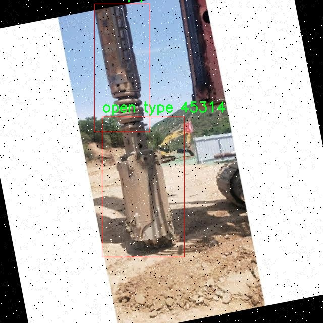

# 工地大型设备检测检测系统源码分享
 # [一条龙教学YOLOV8标注好的数据集一键训练_70+全套改进创新点发刊_Web前端展示]

### 1.研究背景与意义

项目参考[AAAI Association for the Advancement of Artificial Intelligence](https://gitee.com/qunshansj/projects)

项目来源[AACV Association for the Advancement of Computer Vision](https://gitee.com/qunmasj/projects)

研究背景与意义

随着城市化进程的加快和基础设施建设的不断推进，工地大型设备的管理与监控显得尤为重要。大型设备如钻孔铲、钻杆、开口型设备、滚刀和圆凿等在施工过程中扮演着不可或缺的角色。然而，传统的人工监控方式不仅效率低下，而且容易受到人为因素的影响，导致设备管理的失误和安全隐患。因此，构建一个高效、智能的工地大型设备检测系统显得尤为迫切。

近年来，深度学习技术的迅猛发展为物体检测领域带来了新的机遇。YOLO（You Only Look Once）系列模型因其实时性和高准确率而广泛应用于各类物体检测任务。YOLOv8作为该系列的最新版本，具备了更强的特征提取能力和更快的推理速度，适合在复杂的工地环境中进行设备检测。通过对YOLOv8的改进，可以进一步提升其在特定场景下的检测性能，尤其是在大型设备的多样性和复杂性面前。

本研究的核心在于基于改进YOLOv8模型，构建一个针对工地大型设备的检测系统。为此，我们选取了一个包含2100张图像的数据集，涵盖了六个类别的设备，包括钻孔铲、钻杆、开口型设备、人员、滚刀和圆凿。这些类别不仅代表了工地上常见的设备类型，也涉及到施工过程中的人员安全问题。因此，准确检测这些设备的存在与状态，不仅有助于提高施工效率，还能有效降低安全风险。

数据集的构建和标注是本研究的重要基础。通过对多样化的工地场景进行采集，确保了数据集的代表性和全面性。每个类别的设备在不同光照、角度和背景下的表现，均被纳入考虑。这为模型的训练提供了丰富的样本，有助于提升模型的泛化能力。此外，数据集中还包含了与人员相关的类别，强调了在施工现场设备与人员之间的相互关系，进一步增强了系统的实用性。

通过改进YOLOv8模型，我们期望能够实现更高的检测精度和更快的响应速度，从而满足工地实时监控的需求。该系统的应用不仅可以提高设备的使用效率，降低维护成本，还能为施工现场的安全管理提供有力支持。最终，本研究的成果将为工地大型设备的智能化管理提供理论依据和技术支持，推动建筑行业的数字化转型。

综上所述，基于改进YOLOv8的工地大型设备检测系统的研究，不仅具有重要的学术价值，还具备广泛的应用前景。通过深入探讨该系统的设计与实现，能够为相关领域的研究提供新的思路和方法，推动智能监控技术在建筑行业的进一步发展。

### 2.图片演示


##### 注意：由于此博客编辑较早，上面“2.图片演示”和“3.视频演示”展示的系统图片或者视频可能为老版本，新版本在老版本的基础上升级如下：（实际效果以升级的新版本为准）

  （1）适配了YOLOV8的“目标检测”模型和“实例分割”模型，通过加载相应的权重（.pt）文件即可自适应加载模型。

  （2）支持“图片识别”、“视频识别”、“摄像头实时识别”三种识别模式。

  （3）支持“图片识别”、“视频识别”、“摄像头实时识别”三种识别结果保存导出，解决手动导出（容易卡顿出现爆内存）存在的问题，识别完自动保存结果并导出到tempDir中。

  （4）支持Web前端系统中的标题、背景图等自定义修改，后面提供修改教程。

  另外本项目提供训练的数据集和训练教程,暂不提供权重文件（best.pt）,需要您按照教程进行训练后实现图片演示和Web前端界面演示的效果。

### 3.视频演示

[3.1 视频演示](https://www.bilibili.com/video/BV1kVtNe2EJu/)

### 4.数据集信息展示

##### 4.1 本项目数据集详细数据（类别数＆类别名）

nc: 6
names: ['bailing', 'drill pipe', 'open type', 'person', 'roller bits', 'round chisels']


##### 4.2 本项目数据集信息介绍

数据集信息展示

在现代工程建设中，工地大型设备的有效检测与管理至关重要。为了提升对工地设备的智能识别能力，本研究采用了名为“drilling bucket”的数据集，旨在改进YOLOv8模型在工地大型设备检测系统中的表现。该数据集包含了六个主要类别，分别为“bailing”、“drill pipe”、“open type”、“person”、“roller bits”和“round chisels”。这些类别不仅涵盖了各种与钻探相关的设备，还包括了工地上工作人员的识别，为全面监控工地安全与设备使用提供了基础。

首先，数据集中“bailing”类别代表了在钻探过程中用于排水或清除泥浆的设备。这一设备在施工过程中起着至关重要的作用，能够有效地保持施工区域的干燥，从而提高施工效率。其次，“drill pipe”类别则指的是用于连接钻头与钻机的管道，这一设备的状态直接影响到钻探的深度和效率，因此在设备检测中尤为重要。

此外，“open type”类别涉及到一些开放式的设备或工具，这些设备通常在工地上使用频繁，具有多种功能，能够适应不同的施工需求。对于工地大型设备的管理而言，准确识别这一类别的设备，有助于提升施工的灵活性和安全性。

在人员识别方面，“person”类别的引入使得数据集不仅局限于设备本身，还能够对工地上的工作人员进行监控与管理。这一类别的识别对于保障工人安全、避免事故发生具有重要意义，尤其是在设备运作时，能够实时监测人员的活动状态，确保施工环境的安全性。

“roller bits”和“round chisels”两个类别则分别代表了用于钻探和切割的工具。这些工具在钻探过程中发挥着关键作用，能够影响钻探的效率和质量。因此，准确识别这些工具不仅能够提高设备的使用效率，还能够在设备维护和管理中提供重要的数据支持。

整个“drilling bucket”数据集的构建，旨在为YOLOv8模型提供丰富的训练样本，使其能够在复杂的工地环境中准确识别各种设备和人员。通过对这些类别的深入学习，模型将能够更好地适应实际工地的需求，提升检测的准确性和实时性。此外，数据集的多样性和全面性也为后续的模型优化提供了良好的基础，使得在不同的工地场景下，模型能够灵活应对各种设备的识别任务。

总之，“drilling bucket”数据集的构建不仅为工地大型设备的智能检测提供了强有力的支持，也为提升施工安全、提高施工效率奠定了基础。通过对该数据集的深入分析与应用，未来的工地管理将更加智能化和高效化，为建筑行业的发展注入新的活力。





### 5.全套项目环境部署视频教程（零基础手把手教学）

[5.1 环境部署教程链接（零基础手把手教学）](https://www.ixigua.com/7404473917358506534?logTag=c807d0cbc21c0ef59de5)


[5.2 安装Python虚拟环境创建和依赖库安装视频教程链接（零基础手把手教学）](https://www.ixigua.com/7404474678003106304?logTag=1f1041108cd1f708b01a)

### 6.手把手YOLOV8训练视频教程（零基础小白有手就能学会）

[6.1 手把手YOLOV8训练视频教程（零基础小白有手就能学会）](https://www.ixigua.com/7404477157818401292?logTag=d31a2dfd1983c9668658)

### 7.70+种全套YOLOV8创新点代码加载调参视频教程（一键加载写好的改进模型的配置文件）

[7.1 70+种全套YOLOV8创新点代码加载调参视频教程（一键加载写好的改进模型的配置文件）](https://www.ixigua.com/7404478314661806627?logTag=29066f8288e3f4eea3a4)

### 8.70+种全套YOLOV8创新点原理讲解（非科班也可以轻松写刊发刊，V10版本正在科研待更新）

由于篇幅限制，每个创新点的具体原理讲解就不一一展开，具体见下列网址中的创新点对应子项目的技术原理博客网址【Blog】：


[8.1 70+种全套YOLOV8创新点原理讲解链接](https://gitee.com/qunmasj/good)

### 9.系统功能展示（检测对象为举例，实际内容以本项目数据集为准）

图9.1.系统支持检测结果表格显示

  图9.2.系统支持置信度和IOU阈值手动调节

  图9.3.系统支持自定义加载权重文件best.pt(需要你通过步骤5中训练获得)

  图9.4.系统支持摄像头实时识别

  图9.5.系统支持图片识别

  图9.6.系统支持视频识别

  图9.7.系统支持识别结果文件自动保存

  图9.8.系统支持Excel导出检测结果数据


### 10.原始YOLOV8算法原理

原始YOLOv8算法原理

YOLOv8（You Only Look Once version 8）作为目标检测领域的一项重要进展，继承并优化了YOLO系列算法的核心思想，旨在实现更高效、更精确的目标检测。其设计理念围绕着实时性和准确性展开，采用了更深的卷积神经网络结构，确保能够在多种应用场景中提供优异的性能。

YOLOv8的网络结构主要由三个部分组成：骨干特征提取网络、特征融合层和检测头层。骨干特征提取网络负责从输入图像中提取特征信息，这一部分在YOLOv8中经过了精心设计和优化。相较于前代版本，YOLOv8引入了C2F模块来替代原有的C3模块。C2F模块通过更轻量化的卷积结构，采用3×3的卷积核和深度为3、6、6、3的配置，显著降低了计算复杂度，同时保持了特征提取的有效性。这种设计使得YOLOv8在处理高分辨率图像时，能够快速而准确地提取出关键信息。

在特征融合层，YOLOv8采用了特征金字塔网络（FPN）与路径聚合网络（PAN）的结合，以实现对不同尺度特征的有效融合。特征金字塔网络通过构建多层次的特征图，帮助模型在不同尺度上进行目标检测，而路径聚合网络则进一步增强了特征之间的连接性，使得信息能够在不同层次间流动，从而提升了检测的准确性和鲁棒性。此外，为了进一步减轻模型的负担，YOLOv8在特征融合网络中引入了BiFPN（Bidirectional Feature Pyramid Network），该网络通过高效的双向跨尺度连接和加权特征融合，优化了特征信息的提取速度和质量。

在检测头层，YOLOv8使用了轻量化的解耦头，取代了传统的耦合头。这一创新使得模型能够在进行目标检测时，更加灵活地处理不同类别的目标，并有效减少了计算资源的消耗。通过引入有错目标检测机制，YOLOv8能够在没有锚框的情况下，直接从特征图中生成检测结果，进一步提升了检测的速度和准确性。

YOLOv8还引入了多尺度训练和测试的策略，这一策略使得模型在训练过程中能够接触到不同尺寸的目标，从而增强了其对各种目标的适应能力。在测试阶段，YOLOv8能够自适应地调整检测策略，以适应不同的场景和目标尺寸，确保在各种环境下都能保持良好的检测性能。

通过与之前的版本进行比较，YOLOv8在精度和帧率上均有显著提升。根据相关研究，YOLOv8在目标检测的平均精度（mAP）上提高了43.23%，而帧率则提升了10.28倍。这一系列的优化使得YOLOv8在实际应用中表现出色，尤其是在智能监控、自动驾驶和人脸识别等领域，能够快速、准确地识别和定位目标。

综上所述，YOLOv8算法的原理在于通过优化网络结构、引入新技术以及改进检测机制，来实现高效的目标检测。其轻量化设计和多尺度处理能力，使得YOLOv8在保持高精度的同时，能够以更快的速度处理图像数据。这些特性使得YOLOv8成为当前目标检测领域的重要工具，为各类应用提供了强有力的支持。随着YOLOv8的不断发展和应用，未来的目标检测技术将会更加智能化和高效化。


### 11.项目核心源码讲解（再也不用担心看不懂代码逻辑）

#### 11.1 code\ultralytics\utils\callbacks\dvc.py

以下是经过简化和注释的核心代码部分，保留了最重要的功能，并对每个函数进行了详细的中文注释：

```python
# 导入必要的库
from ultralytics.utils import LOGGER, SETTINGS, TESTS_RUNNING, checks

try:
    # 确保测试未运行且DVC集成已启用
    assert not TESTS_RUNNING
    assert SETTINGS["dvc"] is True
    import dvclive

    # 检查dvclive版本
    assert checks.check_version("dvclive", "2.11.0", verbose=True)

    import os
    import re
    from pathlib import Path

    # DVCLive日志记录实例
    live = None
    _processed_plots = {}
    _training_epoch = False  # 标记当前是否为训练周期

except (ImportError, AssertionError, TypeError):
    dvclive = None  # 如果导入失败，则将dvclive设置为None


def _log_images(path, prefix=""):
    """记录指定路径的图像，使用DVCLive进行日志记录。"""
    if live:  # 如果DVCLive实例存在
        name = path.name
        # 通过批次分组图像，以便在UI中启用滑块
        m = re.search(r"_batch(\d+)", name)
        if m:
            ni = m[1]
            new_stem = re.sub(r"_batch(\d+)", "_batch", path.stem)
            name = (Path(new_stem) / ni).with_suffix(path.suffix)

        live.log_image(os.path.join(prefix, name), path)  # 记录图像


def _log_plots(plots, prefix=""):
    """记录训练进度的图像，如果之前未处理过。"""
    for name, params in plots.items():
        timestamp = params["timestamp"]
        if _processed_plots.get(name) != timestamp:  # 检查图像是否已处理
            _log_images(name, prefix)  # 记录图像
            _processed_plots[name] = timestamp  # 更新已处理图像的时间戳


def _log_confusion_matrix(validator):
    """使用DVCLive记录给定验证器的混淆矩阵。"""
    targets = []
    preds = []
    matrix = validator.confusion_matrix.matrix
    names = list(validator.names.values())
    if validator.confusion_matrix.task == "detect":
        names += ["background"]  # 如果任务是检测，添加背景类

    # 构建目标和预测列表
    for ti, pred in enumerate(matrix.T.astype(int)):
        for pi, num in enumerate(pred):
            targets.extend([names[ti]] * num)
            preds.extend([names[pi]] * num)

    live.log_sklearn_plot("confusion_matrix", targets, preds, name="cf.json", normalized=True)  # 记录混淆矩阵


def on_pretrain_routine_start(trainer):
    """在预训练例程开始时初始化DVCLive日志记录器。"""
    try:
        global live
        live = dvclive.Live(save_dvc_exp=True, cache_images=True)  # 创建DVCLive实例
        LOGGER.info("DVCLive已检测到，自动记录已启用。")
    except Exception as e:
        LOGGER.warning(f"警告⚠️ DVCLive安装但未正确初始化，未记录此运行。{e}")


def on_train_start(trainer):
    """如果DVCLive日志记录处于活动状态，则记录训练参数。"""
    if live:
        live.log_params(trainer.args)  # 记录训练参数


def on_fit_epoch_end(trainer):
    """在每个训练周期结束时记录训练指标和模型信息。"""
    global _training_epoch
    if live and _training_epoch:
        all_metrics = {**trainer.label_loss_items(trainer.tloss, prefix="train"), **trainer.metrics, **trainer.lr}
        for metric, value in all_metrics.items():
            live.log_metric(metric, value)  # 记录每个指标

        _log_plots(trainer.plots, "train")  # 记录训练图像
        live.next_step()  # 进入下一个步骤
        _training_epoch = False  # 重置训练周期标记


def on_train_end(trainer):
    """在训练结束时记录最佳指标、图像和混淆矩阵。"""
    if live:
        all_metrics = {**trainer.label_loss_items(trainer.tloss, prefix="train"), **trainer.metrics, **trainer.lr}
        for metric, value in all_metrics.items():
            live.log_metric(metric, value, plot=False)  # 记录最佳指标

        _log_confusion_matrix(trainer.validator)  # 记录混淆矩阵
        live.end()  # 结束日志记录


# 定义回调函数
callbacks = {
    "on_pretrain_routine_start": on_pretrain_routine_start,
    "on_train_start": on_train_start,
    "on_fit_epoch_end": on_fit_epoch_end,
    "on_train_end": on_train_end,
} if dvclive else {}
```

### 代码核心部分分析：
1. **日志记录功能**：通过DVCLive库记录训练过程中的图像、指标和混淆矩阵。
2. **回调机制**：定义了一系列回调函数，在训练的不同阶段（如开始、结束、每个周期结束）执行特定的日志记录操作。
3. **异常处理**：在导入和初始化DVCLive时进行了异常处理，确保在无法使用DVCLive时不会导致程序崩溃。

以上代码是实现YOLO训练过程中的日志记录功能的核心部分，确保了训练过程中的重要信息能够被有效记录和分析。

这个文件是一个用于集成DVCLive的回调函数模块，主要用于在Ultralytics YOLO训练过程中记录和可视化训练的相关信息。首先，文件导入了一些必要的模块和库，包括Ultralytics的日志记录器、设置和检查工具，以及DVCLive库。通过一些断言，确保在非测试环境下运行，并且DVCLive集成已启用。

在文件中，定义了一个全局变量`live`，用于存储DVCLive的实例，以及一个字典`_processed_plots`，用于跟踪已处理的图像。接下来，定义了一些私有函数来处理图像和图表的记录，包括`_log_images`、`_log_plots`和`_log_confusion_matrix`。这些函数的主要作用是将训练过程中的图像、图表和混淆矩阵记录到DVCLive中，以便后续的可视化和分析。

`on_pretrain_routine_start`和`on_pretrain_routine_end`函数分别在预训练开始和结束时被调用，前者初始化DVCLive记录器，后者记录训练过程中的图表。`on_train_start`函数在训练开始时记录训练参数，而`on_train_epoch_start`函数则在每个训练周期开始时设置一个全局变量，指示当前处于训练周期中。

`on_fit_epoch_end`函数在每个训练周期结束时被调用，记录训练指标和模型信息，并更新到DVCLive中。最后，`on_train_end`函数在训练结束时记录最佳指标、图表和混淆矩阵，并结束DVCLive的记录。

文件的最后部分定义了一个`callbacks`字典，其中包含了上述回调函数，只有在DVCLive可用时才会填充这个字典。这些回调函数将在训练过程中被触发，以实现实时记录和可视化。整体而言，这个模块的设计旨在提高训练过程的可追踪性和可视化效果，帮助用户更好地理解和分析模型的训练情况。

#### 11.2 70+种YOLOv8算法改进源码大全和调试加载训练教程（非必要）\ultralytics\data\build.py

以下是代码中最核心的部分，并附上详细的中文注释：

```python
import os
import random
import numpy as np
import torch
from torch.utils.data import dataloader, distributed
from .dataset import YOLODataset
from .utils import PIN_MEMORY

class InfiniteDataLoader(dataloader.DataLoader):
    """
    无限数据加载器，重复使用工作线程。

    继承自普通的 DataLoader，使用相同的语法。
    """

    def __init__(self, *args, **kwargs):
        """初始化无限数据加载器，继承自 DataLoader。"""
        super().__init__(*args, **kwargs)
        # 使用 _RepeatSampler 使得 batch_sampler 可以无限重复
        object.__setattr__(self, 'batch_sampler', _RepeatSampler(self.batch_sampler))
        self.iterator = super().__iter__()

    def __len__(self):
        """返回 batch_sampler 的长度。"""
        return len(self.batch_sampler.sampler)

    def __iter__(self):
        """创建一个无限重复的采样器。"""
        for _ in range(len(self)):
            yield next(self.iterator)

    def reset(self):
        """
        重置迭代器。

        当我们想在训练过程中修改数据集设置时，这个方法非常有用。
        """
        self.iterator = self._get_iterator()


class _RepeatSampler:
    """
    无限重复的采样器。

    参数:
        sampler (Dataset.sampler): 要重复的采样器。
    """

    def __init__(self, sampler):
        """初始化一个可以无限重复给定采样器的对象。"""
        self.sampler = sampler

    def __iter__(self):
        """迭代 'sampler' 并返回其内容。"""
        while True:
            yield from iter(self.sampler)


def seed_worker(worker_id):
    """设置数据加载器工作线程的随机种子。"""
    worker_seed = torch.initial_seed() % 2 ** 32  # 获取当前线程的随机种子
    np.random.seed(worker_seed)  # 设置 numpy 随机种子
    random.seed(worker_seed)  # 设置 random 随机种子


def build_yolo_dataset(cfg, img_path, batch, data, mode='train', rect=False, stride=32):
    """构建 YOLO 数据集。"""
    return YOLODataset(
        img_path=img_path,  # 图像路径
        imgsz=cfg.imgsz,  # 图像大小
        batch_size=batch,  # 批次大小
        augment=mode == 'train',  # 是否进行数据增强
        hyp=cfg,  # 超参数配置
        rect=cfg.rect or rect,  # 是否使用矩形批次
        cache=cfg.cache or None,  # 缓存设置
        single_cls=cfg.single_cls or False,  # 是否单类训练
        stride=int(stride),  # 步幅
        pad=0.0 if mode == 'train' else 0.5,  # 填充
        prefix=colorstr(f'{mode}: '),  # 模式前缀
        use_segments=cfg.task == 'segment',  # 是否使用分割
        use_keypoints=cfg.task == 'pose',  # 是否使用关键点
        classes=cfg.classes,  # 类别
        data=data,  # 数据配置
        fraction=cfg.fraction if mode == 'train' else 1.0  # 训练时的样本比例
    )


def build_dataloader(dataset, batch, workers, shuffle=True, rank=-1):
    """返回用于训练或验证集的 InfiniteDataLoader 或 DataLoader。"""
    batch = min(batch, len(dataset))  # 确保批次大小不超过数据集大小
    nd = torch.cuda.device_count()  # 获取 CUDA 设备数量
    nw = min([os.cpu_count() // max(nd, 1), batch if batch > 1 else 0, workers])  # 计算工作线程数量
    sampler = None if rank == -1 else distributed.DistributedSampler(dataset, shuffle=shuffle)  # 分布式采样器
    generator = torch.Generator()  # 创建随机数生成器
    generator.manual_seed(6148914691236517205 + RANK)  # 设置随机种子
    return InfiniteDataLoader(dataset=dataset,
                              batch_size=batch,
                              shuffle=shuffle and sampler is None,
                              num_workers=nw,
                              sampler=sampler,
                              pin_memory=PIN_MEMORY,
                              collate_fn=getattr(dataset, 'collate_fn', None),
                              worker_init_fn=seed_worker,
                              generator=generator)  # 返回无限数据加载器


def check_source(source):
    """检查源类型并返回相应的标志值。"""
    webcam, screenshot, from_img, in_memory, tensor = False, False, False, False, False
    if isinstance(source, (str, int, Path)):  # 字符串、整数或路径
        source = str(source)
        is_file = Path(source).suffix[1:] in (IMG_FORMATS + VID_FORMATS)  # 检查是否为文件
        is_url = source.lower().startswith(('https://', 'http://', 'rtsp://', 'rtmp://', 'tcp://'))  # 检查是否为 URL
        webcam = source.isnumeric() or source.endswith('.streams') or (is_url and not is_file)  # 检查是否为摄像头
        screenshot = source.lower() == 'screen'  # 检查是否为屏幕截图
        if is_url and is_file:
            source = check_file(source)  # 下载文件
    elif isinstance(source, LOADERS):
        in_memory = True  # 如果是加载器，标记为内存中
    elif isinstance(source, (list, tuple)):
        source = autocast_list(source)  # 将列表元素转换为 PIL 或 np 数组
        from_img = True
    elif isinstance(source, (Image.Image, np.ndarray)):
        from_img = True  # 如果是图像或数组
    elif isinstance(source, torch.Tensor):
        tensor = True  # 如果是张量
    else:
        raise TypeError('不支持的图像类型。')

    return source, webcam, screenshot, from_img, in_memory, tensor


def load_inference_source(source=None, imgsz=640, vid_stride=1, buffer=False):
    """
    加载用于目标检测的推理源并应用必要的变换。

    参数:
        source (str, Path, Tensor, PIL.Image, np.ndarray): 输入源。
        imgsz (int, optional): 推理图像大小，默认为 640。
        vid_stride (int, optional): 视频源的帧间隔，默认为 1。
        buffer (bool, optional): 是否缓冲流帧，默认为 False。

    返回:
        dataset (Dataset): 指定输入源的数据集对象。
    """
    source, webcam, screenshot, from_img, in_memory, tensor = check_source(source)  # 检查源类型
    # 根据源类型加载数据集
    if tensor:
        dataset = LoadTensor(source)  # 加载张量
    elif in_memory:
        dataset = source  # 使用内存中的数据
    elif webcam:
        dataset = LoadStreams(source, imgsz=imgsz, vid_stride=vid_stride, buffer=buffer)  # 加载摄像头流
    elif screenshot:
        dataset = LoadScreenshots(source, imgsz=imgsz)  # 加载屏幕截图
    elif from_img:
        dataset = LoadPilAndNumpy(source, imgsz=imgsz)  # 加载 PIL 或 Numpy 图像
    else:
        dataset = LoadImages(source, imgsz=imgsz, vid_stride=vid_stride)  # 加载图像文件

    # 将源类型附加到数据集
    setattr(dataset, 'source_type', source.source_type if in_memory else SourceTypes(webcam, screenshot, from_img, tensor))

    return dataset  # 返回数据集对象
```

以上代码主要实现了一个无限循环的数据加载器 `InfiniteDataLoader`，用于在训练过程中不断提供数据，同时还包含了数据集的构建、源类型的检查和推理源的加载等功能。每个函数和类都附有详细的中文注释，帮助理解其功能和用途。

这个程序文件是一个用于构建YOLOv8算法数据加载器的Python脚本，主要涉及数据集的加载和处理。文件中首先导入了一些必要的库，包括操作系统相关的库、随机数生成库、路径处理库、NumPy、PyTorch及其数据加载模块，以及一些来自Ultralytics库的特定功能。

在文件中定义了一个名为`InfiniteDataLoader`的类，它继承自PyTorch的`DataLoader`，并实现了一个无限循环的采样器。这意味着在训练过程中，数据加载器可以不断地重复使用工作线程，以便在数据集用尽时不会停止。这对于长时间的训练过程非常有用。该类还提供了重置迭代器的功能，以便在训练期间可以修改数据集的设置。

`_RepeatSampler`类则是一个简单的采样器，它可以无限重复给定的采样器。它的主要作用是保证数据的持续供应。

`seed_worker`函数用于设置数据加载器工作线程的随机种子，以确保在多线程环境下的随机性一致性。这对于调试和复现实验结果非常重要。

`build_yolo_dataset`函数用于构建YOLO数据集，接受配置参数、图像路径、批次大小等信息，并返回一个`YOLODataset`对象。这个函数还处理了一些数据增强的选项，确保在训练模式下应用相应的增强策略。

`build_dataloader`函数则用于返回一个`InfiniteDataLoader`或标准的`DataLoader`，并根据可用的CUDA设备和CPU核心数来确定工作线程的数量。它还处理了分布式训练的情况，并确保数据加载的高效性。

`check_source`函数用于检查输入源的类型，并返回相应的标志值。这些输入源可以是文件路径、摄像头、图像、张量等。这个函数确保输入的灵活性，并处理不同类型的数据源。

最后，`load_inference_source`函数用于加载推理源，并对其进行必要的转换。它根据输入源的类型选择合适的数据加载方式，并返回一个数据集对象，以便后续的推理过程。

整体来看，这个文件的主要功能是提供一个灵活、高效的数据加载机制，以支持YOLOv8算法的训练和推理过程。通过合理的设计，确保了数据的持续供应和多种数据源的兼容性。

#### 11.3 ui.py

以下是代码中最核心的部分，并附上详细的中文注释：

```python
import sys
import subprocess

def run_script(script_path):
    """
    使用当前 Python 环境运行指定的脚本。

    Args:
        script_path (str): 要运行的脚本路径

    Returns:
        None
    """
    # 获取当前 Python 解释器的路径
    python_path = sys.executable

    # 构建运行命令，使用 streamlit 运行指定的脚本
    command = f'"{python_path}" -m streamlit run "{script_path}"'

    # 执行命令，shell=True 允许使用 shell 命令
    result = subprocess.run(command, shell=True)
    
    # 检查命令执行的返回码，如果不为 0 则表示出错
    if result.returncode != 0:
        print("脚本运行出错。")

# 实例化并运行应用
if __name__ == "__main__":
    # 指定要运行的脚本路径
    script_path = "web.py"  # 这里可以替换为实际的脚本路径

    # 调用函数运行脚本
    run_script(script_path)
```

### 代码注释说明：
1. **导入模块**：
   - `sys`：用于访问与 Python 解释器紧密相关的变量和函数。
   - `subprocess`：用于执行外部命令。

2. **定义 `run_script` 函数**：
   - 该函数接收一个脚本路径作为参数，并使用当前 Python 环境运行该脚本。

3. **获取 Python 解释器路径**：
   - `sys.executable` 返回当前 Python 解释器的路径，确保可以使用正确的 Python 环境。

4. **构建命令**：
   - 使用 f-string 构建一个命令字符串，该命令将使用 `streamlit` 模块运行指定的脚本。

5. **执行命令**：
   - `subprocess.run` 用于执行构建的命令，`shell=True` 允许在 shell 中执行命令。

6. **检查执行结果**：
   - 通过检查 `result.returncode` 来判断命令是否成功执行，返回码为 0 表示成功，其他值表示出错。

7. **主程序入口**：
   - 使用 `if __name__ == "__main__":` 确保该部分代码仅在直接运行脚本时执行。
   - 指定要运行的脚本路径，并调用 `run_script` 函数执行该脚本。

这个程序文件的主要功能是使用当前的 Python 环境来运行一个指定的脚本，具体是通过 Streamlit 框架来启动一个 Web 应用。程序首先导入了必要的模块，包括 `sys`、`os` 和 `subprocess`，以及一个自定义的路径处理模块 `abs_path`。

在 `run_script` 函数中，首先获取当前 Python 解释器的路径，这样可以确保使用的是正确的 Python 环境。接着，构建一个命令字符串，该命令用于运行指定的脚本，这里使用了 Streamlit 的命令格式。然后，使用 `subprocess.run` 方法来执行这个命令，`shell=True` 参数表示在 shell 中执行命令。

如果脚本运行过程中出现错误，`result.returncode` 将不等于 0，程序会打印出“脚本运行出错”的提示信息。

在文件的最后部分，使用 `if __name__ == "__main__":` 语句来确保只有在直接运行该文件时才会执行以下代码。这里指定了要运行的脚本路径，调用 `abs_path` 函数来获取该路径的绝对路径，随后调用 `run_script` 函数来启动这个脚本。

整体来看，这个程序文件的结构简单明了，主要功能是启动一个名为 `web.py` 的 Streamlit 应用，并且在运行过程中能够处理错误情况。

#### 11.4 70+种YOLOv8算法改进源码大全和调试加载训练教程（非必要）\ultralytics\nn\backbone\efficientViT.py

以下是经过简化和注释的核心代码部分，保留了 EfficientViT 模型的主要结构和功能。

```python
import torch
import torch.nn as nn
import torch.nn.functional as F
import itertools

# 定义卷积层和批归一化的组合类
class Conv2d_BN(torch.nn.Sequential):
    def __init__(self, in_channels, out_channels, kernel_size=1, stride=1, padding=0, dilation=1, groups=1, bn_weight_init=1):
        super().__init__()
        # 添加卷积层
        self.add_module('conv', torch.nn.Conv2d(in_channels, out_channels, kernel_size, stride, padding, dilation, groups, bias=False))
        # 添加批归一化层
        self.add_module('bn', torch.nn.BatchNorm2d(out_channels))
        # 初始化批归一化的权重
        torch.nn.init.constant_(self.bn.weight, bn_weight_init)
        torch.nn.init.constant_(self.bn.bias, 0)

    @torch.no_grad()
    def switch_to_deploy(self):
        # 将训练模式下的卷积和批归一化转换为推理模式
        conv, bn = self._modules.values()
        w = bn.weight / (bn.running_var + bn.eps)**0.5
        w = conv.weight * w[:, None, None, None]
        b = bn.bias - bn.running_mean * bn.weight / (bn.running_var + bn.eps)**0.5
        # 创建新的卷积层并复制权重和偏置
        m = torch.nn.Conv2d(w.size(1) * conv.groups, w.size(0), w.shape[2:], stride=conv.stride, padding=conv.padding, dilation=conv.dilation, groups=conv.groups)
        m.weight.data.copy_(w)
        m.bias.data.copy_(b)
        return m

# 定义高效ViT模型的基本块
class EfficientViTBlock(torch.nn.Module):
    def __init__(self, in_channels, key_dim, num_heads=8, window_size=7):
        super().__init__()
        # 定义卷积和前馈网络
        self.dw0 = Conv2d_BN(in_channels, in_channels, kernel_size=3, stride=1, padding=1, groups=in_channels)
        self.ffn0 = nn.Sequential(Conv2d_BN(in_channels, in_channels * 2), nn.ReLU(), Conv2d_BN(in_channels * 2, in_channels))
        self.mixer = LocalWindowAttention(in_channels, key_dim, num_heads, window_size)
        self.dw1 = Conv2d_BN(in_channels, in_channels, kernel_size=3, stride=1, padding=1, groups=in_channels)
        self.ffn1 = nn.Sequential(Conv2d_BN(in_channels, in_channels * 2), nn.ReLU(), Conv2d_BN(in_channels * 2, in_channels))

    def forward(self, x):
        # 前向传播
        x = self.ffn1(self.dw1(self.mixer(self.ffn0(self.dw0(x)))))
        return x

# 定义高效ViT模型
class EfficientViT(torch.nn.Module):
    def __init__(self, img_size=224, patch_size=16, embed_dim=[64, 128, 192], depth=[1, 2, 3], num_heads=[4, 4, 4], window_size=[7, 7, 7]):
        super().__init__()
        # 初始化图像嵌入层
        self.patch_embed = nn.Sequential(Conv2d_BN(3, embed_dim[0] // 8, kernel_size=3, stride=2, padding=1), nn.ReLU())
        # 初始化模型的多个块
        self.blocks = nn.ModuleList()
        for i in range(len(depth)):
            for _ in range(depth[i]):
                self.blocks.append(EfficientViTBlock(embed_dim[i], embed_dim[i] // num_heads[i], num_heads[i], window_size[i]))

    def forward(self, x):
        # 前向传播
        x = self.patch_embed(x)
        for block in self.blocks:
            x = block(x)
        return x

# 实例化高效ViT模型
if __name__ == '__main__':
    model = EfficientViT()
    inputs = torch.randn((1, 3, 224, 224))  # 输入的图像大小
    res = model(inputs)  # 前向传播
    print(res.size())  # 输出结果的大小
```

### 代码注释说明：
1. **Conv2d_BN 类**：封装了卷积层和批归一化层，并提供了权重初始化和推理模式转换的功能。
2. **EfficientViTBlock 类**：定义了高效ViT的基本构建块，包括卷积层、前馈网络和局部窗口注意力机制。
3. **EfficientViT 类**：构建了整个高效ViT模型，包含图像嵌入层和多个高效ViT块的组合。
4. **主程序**：实例化模型并进行一次前向传播，输出结果的大小。

以上代码保留了高效ViT模型的核心结构，去除了不必要的部分，便于理解和使用。

这个程序文件实现了EfficientViT模型的架构，主要用于计算机视觉中的下游任务。代码的结构清晰，包含多个类和函数，每个部分都有其特定的功能。

首先，文件导入了必要的库，包括PyTorch和一些辅助模块。接着，定义了一些常量和可用的EfficientViT模型配置。

在模型的实现中，`Conv2d_BN`类是一个组合模块，包含卷积层和批归一化层。它的构造函数允许用户指定卷积的参数，并初始化批归一化的权重。`switch_to_deploy`方法用于在推理时将批归一化层融合到卷积层中，以提高推理速度。

`replace_batchnorm`函数用于替换网络中的批归一化层，通常在推理阶段进行，以减少计算量。

`PatchMerging`类实现了一个用于特征图合并的模块，使用卷积和激活函数进行处理，并引入了Squeeze-and-Excitation机制来增强特征表达。

`Residual`类实现了残差连接，允许在训练时使用随机丢弃来增强模型的鲁棒性。

`FFN`类实现了前馈神经网络，包含两个卷积层和一个ReLU激活函数。

`CascadedGroupAttention`和`LocalWindowAttention`类实现了不同类型的注意力机制，前者是级联的组注意力，后者是局部窗口注意力。这些注意力机制通过卷积层提取特征，并计算注意力权重，以增强模型对重要特征的关注。

`EfficientViTBlock`类是EfficientViT的基本构建块，结合了卷积、前馈网络和注意力机制。

`EfficientViT`类是整个模型的主体，负责构建不同的块并将它们组合在一起。它的构造函数接受多个参数，包括图像大小、嵌入维度、深度等，灵活性很高。

在模型的末尾，定义了一些不同配置的EfficientViT模型（如EfficientViT_m0到EfficientViT_m5），这些配置通过不同的参数组合来适应不同的任务需求。

最后，`update_weight`函数用于更新模型的权重，并在主程序中展示了如何实例化模型并进行前向传播，输出特征图的尺寸。

总体来说，这个文件提供了一个高效的视觉Transformer模型的实现，适用于各种计算机视觉任务，并且具备良好的可扩展性和灵活性。

#### 11.5 train.py

以下是经过简化和注释的核心代码部分：

```python
import random
import numpy as np
import torch.nn as nn
from ultralytics.data import build_dataloader, build_yolo_dataset
from ultralytics.engine.trainer import BaseTrainer
from ultralytics.models import yolo
from ultralytics.nn.tasks import DetectionModel
from ultralytics.utils import LOGGER, RANK
from ultralytics.utils.torch_utils import de_parallel, torch_distributed_zero_first

class DetectionTrainer(BaseTrainer):
    """
    DetectionTrainer类用于基于YOLO模型进行目标检测的训练。
    """

    def build_dataset(self, img_path, mode="train", batch=None):
        """
        构建YOLO数据集。

        参数:
            img_path (str): 包含图像的文件夹路径。
            mode (str): 模式，'train'表示训练模式，'val'表示验证模式。
            batch (int, optional): 批次大小，默认为None。
        """
        gs = max(int(de_parallel(self.model).stride.max() if self.model else 0), 32)
        return build_yolo_dataset(self.args, img_path, batch, self.data, mode=mode, rect=mode == "val", stride=gs)

    def get_dataloader(self, dataset_path, batch_size=16, rank=0, mode="train"):
        """构造并返回数据加载器。"""
        assert mode in ["train", "val"]
        with torch_distributed_zero_first(rank):  # 在分布式训练中，确保数据集只初始化一次
            dataset = self.build_dataset(dataset_path, mode, batch_size)
        shuffle = mode == "train"  # 训练模式下打乱数据
        workers = self.args.workers if mode == "train" else self.args.workers * 2
        return build_dataloader(dataset, batch_size, workers, shuffle, rank)  # 返回数据加载器

    def preprocess_batch(self, batch):
        """对图像批次进行预处理，包括缩放和转换为浮点数。"""
        batch["img"] = batch["img"].to(self.device, non_blocking=True).float() / 255  # 将图像转换为浮点数并归一化
        if self.args.multi_scale:  # 如果启用多尺度训练
            imgs = batch["img"]
            sz = (
                random.randrange(self.args.imgsz * 0.5, self.args.imgsz * 1.5 + self.stride)
                // self.stride
                * self.stride
            )  # 随机选择图像大小
            sf = sz / max(imgs.shape[2:])  # 计算缩放因子
            if sf != 1:
                ns = [
                    math.ceil(x * sf / self.stride) * self.stride for x in imgs.shape[2:]
                ]  # 计算新的图像形状
                imgs = nn.functional.interpolate(imgs, size=ns, mode="bilinear", align_corners=False)  # 调整图像大小
            batch["img"] = imgs
        return batch

    def get_model(self, cfg=None, weights=None, verbose=True):
        """返回YOLO目标检测模型。"""
        model = DetectionModel(cfg, nc=self.data["nc"], verbose=verbose and RANK == -1)  # 创建检测模型
        if weights:
            model.load(weights)  # 加载预训练权重
        return model

    def plot_training_samples(self, batch, ni):
        """绘制训练样本及其标注。"""
        plot_images(
            images=batch["img"],
            batch_idx=batch["batch_idx"],
            cls=batch["cls"].squeeze(-1),
            bboxes=batch["bboxes"],
            paths=batch["im_file"],
            fname=self.save_dir / f"train_batch{ni}.jpg",
            on_plot=self.on_plot,
        )

    def plot_metrics(self):
        """从CSV文件中绘制指标。"""
        plot_results(file=self.csv, on_plot=self.on_plot)  # 保存结果图
```

### 代码说明：
1. **DetectionTrainer类**：继承自`BaseTrainer`，用于实现YOLO模型的训练。
2. **build_dataset方法**：根据输入的图像路径和模式（训练或验证）构建YOLO数据集。
3. **get_dataloader方法**：创建数据加载器，支持分布式训练。
4. **preprocess_batch方法**：对输入的图像批次进行预处理，包括归一化和可选的多尺度调整。
5. **get_model方法**：返回一个YOLO目标检测模型，并可选择加载预训练权重。
6. **plot_training_samples方法**：绘制训练样本及其标注，便于可视化训练过程。
7. **plot_metrics方法**：从CSV文件中读取并绘制训练指标，帮助分析模型性能。

这个程序文件 `train.py` 是一个用于训练 YOLO（You Only Look Once）目标检测模型的脚本，继承自 `BaseTrainer` 类。它主要包含了数据集构建、数据加载、模型设置、训练过程中的损失计算、进度显示和结果可视化等功能。

在程序的开头，导入了一些必要的库和模块，包括数学库、随机数生成、深度学习相关的库（如 PyTorch）以及 Ultralytics 提供的 YOLO 相关模块。接着定义了 `DetectionTrainer` 类，该类负责管理整个训练过程。

`build_dataset` 方法用于构建 YOLO 数据集，接受图像路径、模式（训练或验证）和批量大小作为参数。它会根据模型的步幅设置合适的图像尺寸，并调用 `build_yolo_dataset` 函数来生成数据集。

`get_dataloader` 方法用于构建数据加载器，确保在分布式训练时只初始化一次数据集。它根据模式决定是否打乱数据，并设置工作线程的数量。通过调用 `build_dataloader` 函数返回一个数据加载器。

`preprocess_batch` 方法对输入的图像批次进行预处理，包括将图像缩放到合适的大小并转换为浮点数。它还支持多尺度训练，通过随机选择图像大小来增强模型的鲁棒性。

`set_model_attributes` 方法用于设置模型的属性，包括类别数量和类别名称。这些信息会在训练过程中用于计算损失和进行预测。

`get_model` 方法返回一个 YOLO 检测模型的实例，可以选择加载预训练权重。

`get_validator` 方法返回一个用于模型验证的 `DetectionValidator` 实例，设置了损失名称并指定了保存目录。

`label_loss_items` 方法用于返回一个包含训练损失项的字典，便于在训练过程中监控模型的性能。

`progress_string` 方法返回一个格式化的字符串，显示训练进度，包括当前的轮次、GPU 内存使用情况、损失值、实例数量和图像大小。

`plot_training_samples` 方法用于绘制训练样本及其标注，便于可视化训练数据的质量。

最后，`plot_metrics` 和 `plot_training_labels` 方法用于从 CSV 文件中绘制训练过程中的指标和生成带标签的训练图，帮助用户分析模型的训练效果。

总体而言，这个文件提供了一个完整的框架，用于训练 YOLO 模型，包括数据处理、模型构建、训练过程监控和结果可视化等功能。

#### 11.6 code\ultralytics\solutions\object_counter.py

以下是代码中最核心的部分，并附上详细的中文注释：

```python
from collections import defaultdict
import cv2
from shapely.geometry import LineString, Point, Polygon

class ObjectCounter:
    """管理实时视频流中对象计数的类。"""

    def __init__(self):
        """初始化计数器，设置默认参数。"""
        # 鼠标事件相关
        self.is_drawing = False  # 是否正在绘制
        self.selected_point = None  # 选中的点

        # 区域和线的信息
        self.reg_pts = [(20, 400), (1260, 400)]  # 计数区域的点
        self.line_dist_thresh = 15  # 线的距离阈值
        self.counting_region = None  # 计数区域
        self.region_color = (255, 0, 255)  # 区域颜色
        self.region_thickness = 5  # 区域线条厚度

        # 图像和注释信息
        self.im0 = None  # 当前帧图像
        self.tf = None  # 线条厚度
        self.view_img = False  # 是否显示图像
        self.view_in_counts = True  # 是否显示进入计数
        self.view_out_counts = True  # 是否显示离开计数

        # 对象计数信息
        self.in_counts = 0  # 进入计数
        self.out_counts = 0  # 离开计数
        self.counting_list = []  # 正在计数的对象列表

        # 跟踪信息
        self.track_history = defaultdict(list)  # 跟踪历史
        self.track_color = (0, 255, 0)  # 跟踪线颜色

    def set_args(self, classes_names, reg_pts):
        """
        配置计数器的参数，包括类名和计数区域点。

        Args:
            classes_names (dict): 类别名称
            reg_pts (list): 定义计数区域的点
        """
        self.reg_pts = reg_pts  # 设置计数区域的点
        if len(reg_pts) == 2:
            self.counting_region = LineString(self.reg_pts)  # 线性计数
        elif len(reg_pts) == 4:
            self.counting_region = Polygon(self.reg_pts)  # 区域计数
        else:
            raise ValueError("区域点必须是2或4个点")

        self.names = classes_names  # 设置类别名称

    def extract_and_process_tracks(self, tracks):
        """提取并处理视频流中的跟踪数据以进行对象计数。"""
        boxes = tracks[0].boxes.xyxy.cpu()  # 获取边界框
        clss = tracks[0].boxes.cls.cpu().tolist()  # 获取类别
        track_ids = tracks[0].boxes.id.int().cpu().tolist()  # 获取跟踪ID

        # 遍历每个检测到的对象
        for box, track_id, cls in zip(boxes, track_ids, clss):
            # 计算对象的中心点
            center_point = Point((box[0] + box[2]) / 2, (box[1] + box[3]) / 2)

            # 计数逻辑
            if self.counting_region.contains(center_point) and track_id not in self.counting_list:
                self.counting_list.append(track_id)  # 添加到计数列表
                # 判断对象是进入还是离开
                if box[0] < self.counting_region.centroid.x:
                    self.in_counts += 1  # 进入计数
                else:
                    self.out_counts += 1  # 离开计数

    def display_frames(self):
        """显示当前帧图像。"""
        cv2.imshow("Object Counter", self.im0)  # 显示图像
        if cv2.waitKey(1) & 0xFF == ord("q"):  # 按'q'退出
            return

    def start_counting(self, im0, tracks):
        """
        启动对象计数过程。

        Args:
            im0 (ndarray): 当前帧图像。
            tracks (list): 从对象跟踪过程中获得的跟踪列表。
        """
        self.im0 = im0  # 存储当前帧图像
        if tracks[0].boxes.id is None:
            self.display_frames()  # 如果没有检测到对象，直接显示图像
            return
        self.extract_and_process_tracks(tracks)  # 提取和处理跟踪数据
        self.display_frames()  # 显示图像
```

### 代码说明：
1. **类定义**：`ObjectCounter`类用于管理对象计数的逻辑。
2. **初始化方法**：`__init__`方法设置了计数器的初始状态，包括区域点、计数颜色、计数状态等。
3. **设置参数**：`set_args`方法用于配置计数器的参数，包括计数区域的点和类别名称。
4. **提取和处理跟踪数据**：`extract_and_process_tracks`方法从跟踪数据中提取边界框、类别和ID，并根据对象的中心点判断其是否进入或离开计数区域。
5. **显示图像**：`display_frames`方法用于显示当前帧图像。
6. **启动计数**：`start_counting`方法是主要的计数过程，负责处理每一帧图像和跟踪数据。

这个程序文件定义了一个名为 `ObjectCounter` 的类，主要用于在实时视频流中基于物体的轨迹进行计数。程序首先导入了一些必要的库，包括 `cv2`（OpenCV），以及 `shapely` 库中的几何对象用于处理区域和线条。类的构造函数初始化了一些属性，包括鼠标事件的处理、计数区域的定义、图像显示的设置以及物体计数的相关信息。

在 `__init__` 方法中，定义了一些默认值，例如鼠标绘制状态、计数区域的颜色和厚度、图像的显示选项等。类中还使用了 `defaultdict` 来存储物体的轨迹信息，以便于后续的计数和显示。

`set_args` 方法用于配置计数器的参数，包括计数区域的点、线条的厚度、是否显示图像等。根据传入的点数（2或4），程序会初始化一个线段或多边形作为计数区域，并输出相应的提示信息。

`mouse_event_for_region` 方法处理鼠标事件，允许用户通过鼠标在视频流中绘制或移动计数区域。该方法根据鼠标的点击、移动和释放事件更新计数区域的坐标。

`extract_and_process_tracks` 方法提取和处理物体的轨迹信息。它从传入的轨迹数据中获取边界框、类别和轨迹ID，并使用 `Annotator` 类进行可视化。程序会根据物体的运动方向和计数区域的定义，更新进入和离开的计数，并在图像上显示计数信息。

`display_frames` 方法用于显示当前帧图像，并在窗口中设置鼠标回调，以便用户可以交互式地调整计数区域。

`start_counting` 方法是计数过程的主函数，它接收当前帧图像和轨迹数据，调用其他方法进行轨迹提取和计数，并根据用户的设置决定是否显示图像。

最后，在 `__main__` 部分，创建了 `ObjectCounter` 类的实例，表明该程序可以作为独立的脚本运行。整体来看，这个程序实现了一个实时物体计数的功能，能够通过用户交互来设置计数区域，并实时更新和显示计数结果。

### 12.系统整体结构（节选）

### 整体功能和构架概括

该项目主要围绕YOLOv8目标检测算法及其相关功能进行开发，涵盖了数据加载、模型训练、实时推理、物体计数和模型构建等多个方面。项目结构清晰，各个模块功能分明，便于扩展和维护。主要包括以下几个部分：

1. **数据处理**：负责数据集的构建和加载，支持多种数据源和数据增强策略。
2. **模型构建**：实现了YOLOv8及其变种（如EfficientViT）的网络结构，提供了灵活的模型配置。
3. **训练与验证**：实现了训练过程的管理，包括损失计算、进度监控和结果可视化。
4. **实时推理与计数**：提供了实时视频流中的物体检测和计数功能，支持用户交互设置计数区域。
5. **工具与回调**：提供了一些工具函数和回调机制，以便于训练过程中的监控和记录。

### 文件功能整理表

| 文件路径                                                                                   | 功能描述                                                                                     |
|--------------------------------------------------------------------------------------------|----------------------------------------------------------------------------------------------|
| `code\ultralytics\utils\callbacks\dvc.py`                                                  | 集成DVCLive的回调函数，用于记录和可视化训练过程中的信息。                                     |
| `70+种YOLOv8算法改进源码大全和调试加载训练教程（非必要）\ultralytics\data\build.py`          | 构建YOLO数据集和数据加载器，支持多种数据源和数据增强策略。                                   |
| `ui.py`                                                                                   | 启动Streamlit Web应用，用于可视化和交互式操作。                                             |
| `70+种YOLOv8算法改进源码大全和调试加载训练教程（非必要）\ultralytics\nn\backbone\efficientViT.py` | 实现EfficientViT模型的架构，包含卷积、注意力机制和前馈网络等模块。                          |
| `train.py`                                                                                | 管理YOLO模型的训练过程，包括数据加载、损失计算和结果可视化。                                 |
| `code\ultralytics\solutions\object_counter.py`                                            | 实现实时物体计数功能，允许用户设置计数区域并实时更新计数结果。                               |
| `code\ultralytics\models\sam\modules\decoders.py`                                         | 实现SAM（Segment Anything Model）模块中的解码器功能，用于处理模型输出。                     |
| `code\ultralytics\models\utils\__init__.py`                                              | 模型工具模块的初始化文件，可能包含一些常用的工具函数和类。                                   |
| `code\ultralytics\models\yolo\segment\val.py`                                            | 处理YOLO模型在分割任务中的验证过程，计算指标和结果可视化。                                   |
| `70+种YOLOv8算法改进源码大全和调试加载训练教程（非必要）\ultralytics\utils\instance.py`      | 提供实例化相关的工具函数，可能用于模型或数据的实例化处理。                                   |
| `code\ultralytics\data\dataset.py`                                                        | 定义数据集类，处理数据的加载和预处理，支持多种数据格式。                                     |
| `70+种YOLOv8算法改进源码大全和调试加载训练教程（非必要）\ultralytics\models\yolo\pose\__init__.py` | 初始化YOLO姿态估计模型模块，可能包含模型定义和相关工具。                                     |
| `code\ultralytics\models\sam\modules\transformer.py`                                      | 实现SAM模块中的Transformer结构，用于特征提取和处理。                                        |

以上表格整理了项目中各个文件的功能，便于理解和使用该项目。

注意：由于此博客编辑较早，上面“11.项目核心源码讲解（再也不用担心看不懂代码逻辑）”中部分代码可能会优化升级，仅供参考学习，完整“训练源码”、“Web前端界面”和“70+种创新点源码”以“13.完整训练+Web前端界面+70+种创新点源码、数据集获取”的内容为准。

### 13.完整训练+Web前端界面+70+种创新点源码、数据集获取


# [下载链接：https://mbd.pub/o/bread/ZpuVlZhw](https://mbd.pub/o/bread/ZpuVlZhw)